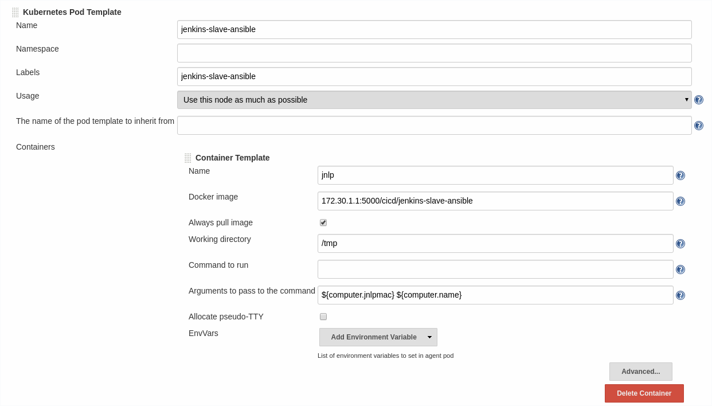

# e2e-pipeline-sample

UPDATED to run on Openshift v4!

Making the ansible slave and Jenkins in a cicd namespace in order to get pipelines working...

This is all using openshift applier, please view the items in `.openshift` and `.applier` in order to get an idea of what is happening in the pipeline, quite reliant on the `jenkins-slave-ansible` that will be built below.

## Get an ansible Jenkins Slave Built

```shell
oc new-project dev
oc new-project release
oc new-project cicd
git clone https://github.com/redhat-cop/containers-quickstarts
cd containers-quickstarts/jenkins-slaves/jenkins-slave-ansible
oc process -f ../.openshift/templates/jenkins-slave-generic-template.yml -p BUILDER_IMAGE_NAME=quay.io/openshift/origin-jenkins-agent-base:4.1    -p NAME=jenkins-slave-ansible     -p SOURCE_CONTEXT_DIR=jenkins-slaves/jenkins-slave-ansible     | oc create -f -
# once the image is built
oc tag cicd/jenkins-slave-ansible:v3.11 cicd/jenkins-slave-ansible:latest
```

## Get a persistent jenkins up and running

```shell
oc create -f https://raw.githubusercontent.com/openshift/origin/master/examples/jenkins/jenkins-persistent-template.json -n openshift
oc new-app --template=jenkins-persistent

```

## Configure the ansible jenkins slave

Surprisingly didn't need to do anything - it's auto configured..!  However, here's an image to show it:



## Create the github secret in the cicd and dev namespaces

```shell
oc create secret generic github-secret --from-literal=username=yourusername --from-literal=password=12345678 -n cicd
oc create secret generic github-secret --from-literal=username=yourusername --from-literal=password=12345678 -n dev
```

## Create the credential inside Jenkins

Create the `cicd-github-secret` in Jenkins with your GitHub credentials


## Give jenkins serviceaccount admin access

```shell
oc policy add-role-to-user admin system:serviceaccount:cicd:jenkins -n dev
oc policy add-role-to-user admin system:serviceaccount:cicd:jenkins -n release
```

## Create the JenkinsFile Pipeline

```shell
oc create -f sample-pipeline.yml
```

Once done, you should get a pipelines you can run from the Openshift web console.


This view will also be available via the traditional Jenkins build job in the persistent Jenkins you have created.


## Webhooks

Can configure webhooks if available on the interwebs

## Issues

I had a `#` in my GitHub password which wasn't ideal.  Caused problems with the git fetch X-)

## Applier Rationale

http://uncontained.io/articles/openshift-template-infra-as-code/#_automation_using_templates_the_openshift_applier_framework